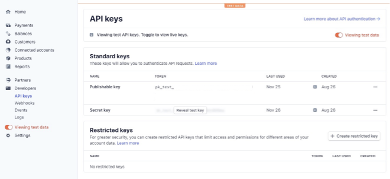

# Secret Keys

There are several secret keys we need to input before we can get up and running with our lg-coffee template.

Env Name | Source | Is Required
---      | ---    | --- 
PUBLISHABLE_KEY | Stripe | Yes
SECRET_KEY | Stripe | Yes
NEXT_PUBLIC_FACEBOOK_PIXEL_ID | Facebook | No

## Stripe (Required)

Stripe is essentialy acting as the Admin dashboard for lg-coffee. 
It's where we will add products, manage invoices and transactions etc. 

A Security Blanket for our appliaction, getting connected with Stripe is essential to getting off the ground with lg-coffee.

You can find your Stripe API keys in the Stripe Dashboard.



⭐  Important Caveats

- While testing on your local machine, be sure to use your Stripe Test Data API Keys.
- After updating your API Keys, restart your local server to see the changes take effect.
- Your app WILL NOT load without your Stripe credentials.

##### .local.env

```
PUBLISHABLE_KEY=stripe_publishable_key
SECRET_KEY=stripe_secret_key
```

