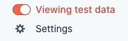

# Local Setup

## 1. Bootstrap Project

`npx lg-init mystorename`

## 2. Install Dependencies

`npm install`

## 3. Set Your Environmental Variables

- Rename your `example.env` to `.env.local`
- Create a [Stripe Account](https://dashboard.stripe.com/) and grab the API Keys from the Test Data Section.
- Replace the values in your .env.local accordingly

#### .env.local
```
PUBLISHABLE_KEY=stripe_api_key
SECRET_KEY=stripe_secret_key
...
```

## 4. Update Store Info and Static Assests

By default, We are presented a store theme. Let's update this to match our Store.

- Head to the `store.js` file in your `utils` folder and update the values with your information. 
- Static images are stored in the `public` folder. Replace these images with your own.
  - favicon.ico _(Must be named favicon.ico)_
  - logo.png _(Optional)_
  - hero.png _(Optional)_

## 5. Add Test Products to your Store

https://dashboard.stripe.com/test/products

Let's head over to the Stripe dashboard again. Create a new product with all the required information.

⭐  Important Caveats

- In order for lg-coffee to read product prices, add a price key with a whole integer as a value to the metadata of each product.

Example:
If your product cost $2.78 USD, you would input 287


- Production Stripe products won't render on your local machine. Be sure you are in Test Mode.

<p align="center">
  
</p>

## 6. Start Your Local Server

Once we have completed the configuration process, we are ready to start our server.

`npm run dev`